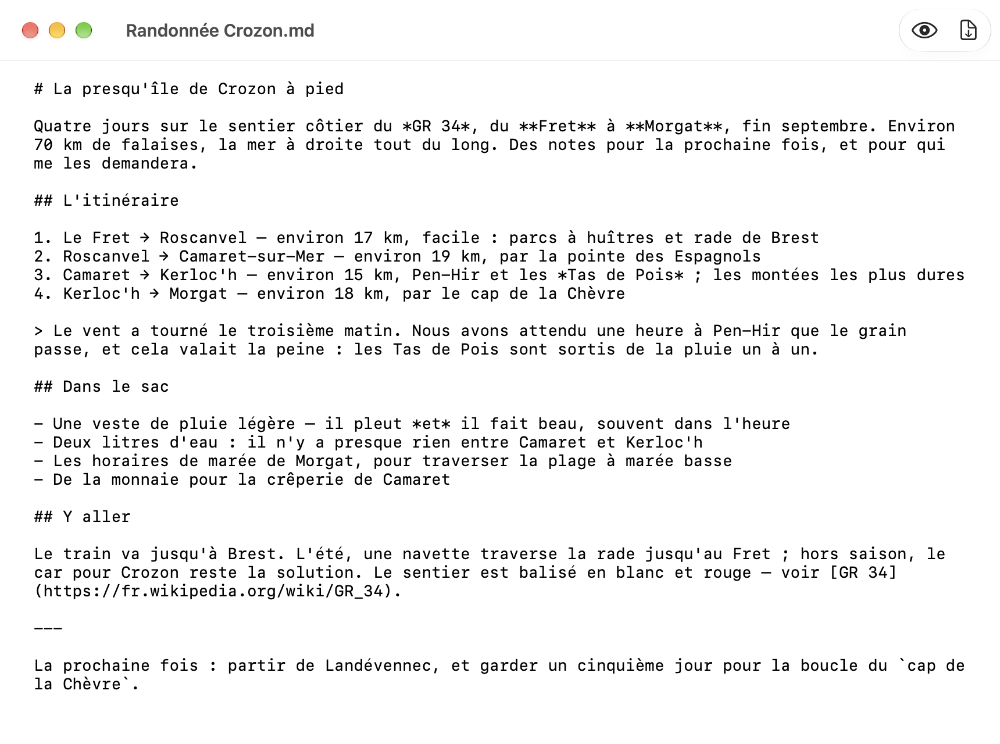
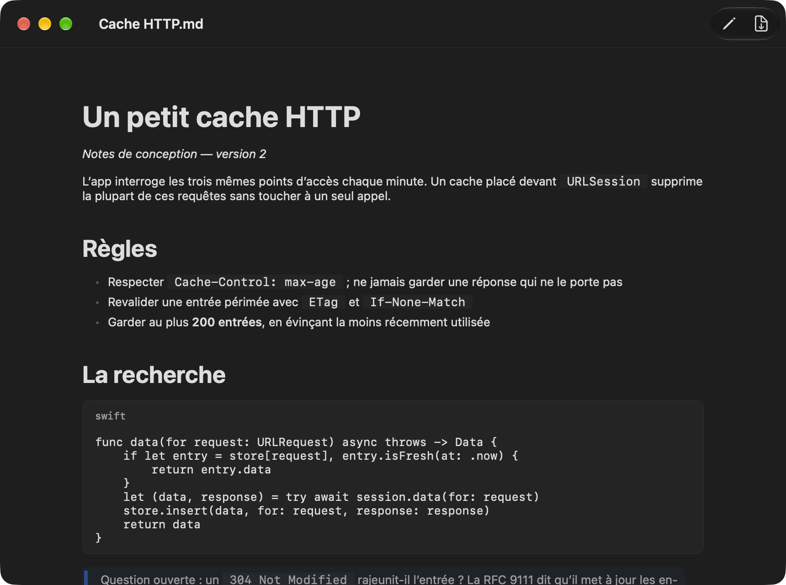

# PlumeMD

[](https://github.com/gwenn-ha-dev/PlumeMD/actions/workflows/ci.yml)
[](./LICENSE)


*🇬🇧 [English](./README.md) · 🇫🇷 Français*

Éditeur Markdown natif macOS, avec une vue rendue et un export PDF paginé. App orientée document : vos fichiers restent les vôtres, sur disque, en Markdown.


## Fonctionnalités

- **De simples fichiers Markdown.** PlumeMD ouvre, édite et enregistre les fichiers `.md`, `.markdown` et `.mdown`, et le texte brut. Ce qui est enregistré est le Markdown que vous avez écrit, en UTF-8, octet pour octet.
- **Un rendu et un éditeur**, à un clic ou <kbd>⇧⌘P</kbd> l'un de l'autre : titres, emphase, texte barré, liens, code en ligne, listes numérotées et à puces, listes imbriquées, citations, blocs de code avec leur langage, filets horizontaux.
- **Export PDF** (<kbd>⇧⌘E</kbd>), au format de papier de vos réglages d'impression, A4 ou US Letter. Les sauts de page tombent entre les blocs, jamais au milieu d'une ligne, et un titre ne reste pas seul en bas de page.
- **Mode clair et mode sombre**, selon le système.
- Anglais et français, selon la langue du système.

| L'éditeur | Mode sombre |
|---|---|
|  |  |

## Installation

Téléchargez **`PlumeMD-<version>.dmg`** depuis la [dernière release](https://github.com/gwenn-ha-dev/PlumeMD/releases/latest), ouvrez-le et glissez PlumeMD sur Applications. L'app est signée avec un Developer ID et notarisée par Apple : elle s'ouvre d'un double clic. Elle demande macOS 26.4 ou plus récent.

Pour la construire depuis les sources :

```sh
git clone https://github.com/gwenn-ha-dev/PlumeMD.git
cd PlumeMD
make package      # build/PlumeMD.app
```

## Utilisation

Ouvrez un fichier Markdown avec PlumeMD, ou créez-en un par *Fichier → Nouveau*. Un document s'ouvre sur son rendu ; le bouton crayon, ou <kbd>⇧⌘P</kbd>, bascule vers l'éditeur et retour. *Exporter PDF* dans la barre d'outils, ou <kbd>⇧⌘E</kbd>, écrit le document rendu dans un PDF.

## Comment ça marche

[swift-markdown](https://github.com/swiftlang/swift-markdown) analyse le texte en arbre de document ; PlumeMD dessine cet arbre avec SwiftUI, bloc par bloc, avec sa propre échelle typographique (`DesignTokens`). L'export PDF rend les mêmes blocs un à un et en remplit les pages.

Pas encore rendus : les tableaux et les images s'affichent comme leur texte source, et les blocs de code ne sont pas colorés.

Le nom porte son format : *Plume* pour l'écriture, *MD* pour Markdown.

## Construction

| Commande | Ce qu'elle fait |
|---|---|
| `make build` | Compilation release, tout avertissement est une erreur |
| `make test` | Lance la suite de tests |
| `make run` | Lance l'app |
| `make icon` | Régénère `Resources/AppIcon.icns` |
| `make package` | Construit `build/PlumeMD.app` |
| `make sign` | La signe avec un Developer ID, la notarise et l'agrafe |
| `make dmg` | Emballe l'app notarisée dans un `.dmg` notarisé |
| `make shots` | Refait les captures de `docs/img/` |
| `make release-check` | Vérifie que `build/` est publiable |
| `make lint` | Vérifie la conformité à la charte |
| `make help` | Liste toutes les cibles |

## Dépendances

[swift-markdown](https://github.com/swiftlang/swift-markdown) (0.7.3+, Apache-2.0),
l'analyseur CommonMark d'Apple. PlumeMD rend l'arbre de document qu'il produit
plutôt que d'analyser le Markdown lui-même ; tout le reste est framework Apple.

## Licence

MIT © 2026 gwenn-ha-dev — voir [LICENSE](./LICENSE).
