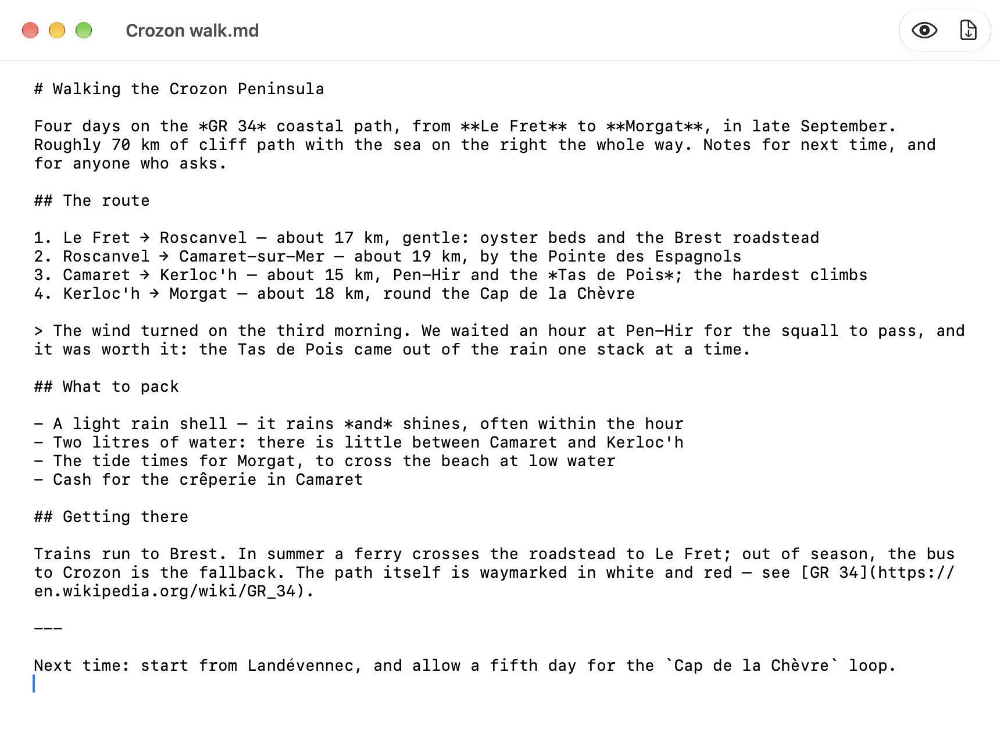
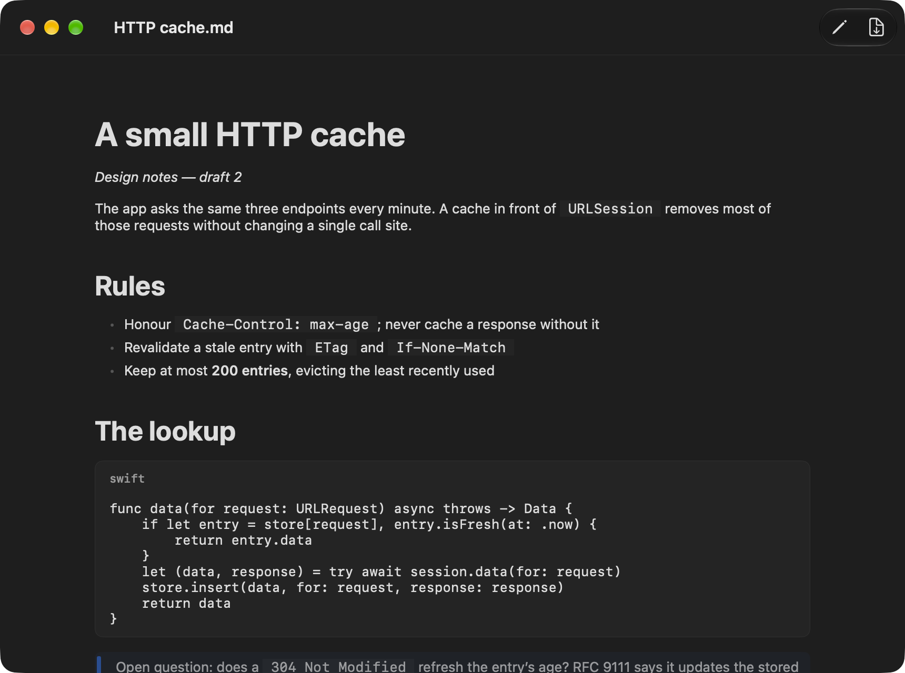

# PlumeMD

[](https://github.com/gwenn-ha-dev/PlumeMD/actions/workflows/ci.yml)
[](./LICENSE)


*🇬🇧 English · 🇫🇷 [Français](./README.fr.md)*

A native macOS Markdown editor with a rendered view and paginated PDF export. A document-based app: your files stay yours, on disk, in Markdown.


## Features

- **Plain Markdown files.** PlumeMD opens, edits and saves `.md`, `.markdown` and `.mdown` files, and plain text. What is saved is the Markdown you wrote, in UTF-8, byte for byte.
- **A rendered view and an editor**, one click or <kbd>⇧⌘P</kbd> apart: headings, emphasis, strikethrough, links, inline code, numbered and bulleted lists, nested lists, quotations, code blocks with their language, horizontal rules.
- **PDF export** (<kbd>⇧⌘E</kbd>), on the paper size of your print settings, A4 or US Letter. Page breaks fall between blocks, never through a line, and a heading is not left alone at the foot of a page.
- **Light and Dark Mode**, following the system.
- English and French, following the system language.

| The editor | Dark Mode |
|---|---|
|  |  |

## Install

Download **`PlumeMD-<version>.dmg`** from the [latest release](https://github.com/gwenn-ha-dev/PlumeMD/releases/latest), open it and drag PlumeMD onto Applications. The app is signed with a Developer ID and notarized by Apple: it opens with a double click. It needs macOS 26.4 or later.

To build from source instead:

```sh
git clone https://github.com/gwenn-ha-dev/PlumeMD.git
cd PlumeMD
make package      # build/PlumeMD.app
```

## Usage

Open a Markdown file with PlumeMD, or create one with *File → New*. A document opens in its rendered view; the pencil button, or <kbd>⇧⌘P</kbd>, switches to the editor and back. *Export PDF* in the toolbar, or <kbd>⇧⌘E</kbd>, writes the rendered document to a PDF.

## How it works

[swift-markdown](https://github.com/swiftlang/swift-markdown) parses the text into a document tree; PlumeMD draws that tree with SwiftUI, block by block, with its own typographic scale (`DesignTokens`). The PDF export renders the same blocks one at a time and fills pages with them.

Not rendered yet: tables and images show as their source text, and code blocks are not syntax-highlighted.

The name carries its format: *Plume* for writing, *MD* for Markdown.

## Build

| Command | What it does |
|---|---|
| `make build` | Release build, warnings are errors |
| `make test` | Run the test suite |
| `make run` | Launch the app |
| `make icon` | Regenerate `Resources/AppIcon.icns` |
| `make package` | Build `build/PlumeMD.app` |
| `make sign` | Sign it with a Developer ID, notarize and staple it |
| `make dmg` | Pack the notarized app into a notarized `.dmg` |
| `make shots` | Retake the captures in `docs/img/` |
| `make release-check` | Check that `build/` is publishable |
| `make lint` | Check compliance with the project charter |
| `make help` | List every target |

## Dependencies

[swift-markdown](https://github.com/swiftlang/swift-markdown) (0.7.3+, Apache-2.0),
Apple's CommonMark parser. PlumeMD renders the document tree it produces rather
than parsing Markdown itself; everything else is Apple frameworks.

## License

MIT © 2026 gwenn-ha-dev — see [LICENSE](./LICENSE).
